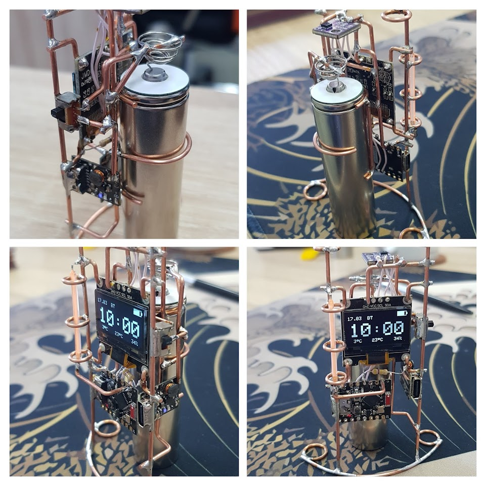

# DIY Stellar Clock - Celsius Version

A minimalist DIY clock project based on ESP32-C3 that displays time, date, temperature, and humidity on an OLED display. Features automatic brightness adjustment for night mode and WiFi-based time synchronization.



## Inspiration

This project is inspired by the [DIY Stellar Clock](https://sites.google.com/view/huy-materials-used/diy-stellar-clock) by Huy Vector DIY.

## Hardware Components

- **ESP32-C3** - Main microcontroller
- **OLED Display** - SSD1306, 128x32 pixels
- **SHT31-D Sensor** - Temperature and humidity sensor
- **LED** - Status indicator (blinks at the start of each hour)
- **Type-C Charging Module** - Power management
- **Battery** - 18350B or similar 3.7V lithium battery
- **Switch** - Power control
- **Copper Wire** - Connections
- **Steel Blank Earring** - Structural component

## Software Requirements

### Required Libraries

- **ESP32 Arduino Core** - Core support for ESP32-C3
- **Adafruit GFX Library** - Graphics library for displays
- **Adafruit SSD1306** - Driver for SSD1306 OLED displays
- **Adafruit SHT31** - Driver for SHT31 temperature/humidity sensor
- **NTPClient** - Network Time Protocol client for time synchronization

### Built-in Libraries Used

- `WiFi.h` - WiFi connectivity
- `Wire.h` - I2C communication
- `WiFiUdp.h` - UDP communication for NTP
- `time.h` - Time functions

## Features

- **Time Display** - Shows hours, minutes, and seconds
- **Date Display** - Shows day and month
- **Temperature & Humidity** - Displays readings from SHT31 sensor
- **WiFi Time Sync** - Automatically synchronizes time via NTP
- **Night Mode** - Automatically reduces display brightness from 22:00 to 07:30
- **Hour Indicator** - LED blinks at the start of each hour (disabled in night mode)

## Configuration

Before uploading the code, configure the following:

1. **WiFi Credentials** (lines 10-11):
   ```cpp
   const char* ssid = "WiFi_SSID";
   const char* password = "WiFi_Password";
   ```

2. **Timezone** (line 21):
   ```cpp
   NTPClient timeClient(ntpUDP, "pool.ntp.org", 3 * 3600, 60000); // GMT+3
   ```
   Change `3 * 3600` to your timezone offset (e.g., `7 * 3600` for GMT+7, `-5 * 3600` for GMT-5)

3. **Night Mode Times** (lines 27-28):
   ```cpp
   #define NIGHT_START_SEC (22 * 3600) // 22:00
   #define NIGHT_END_SEC (7 * 3600 + 30 * 60) // 07:30
   ```

## Pin Configuration

- **I2C SDA**: GPIO 8
- **I2C SCL**: GPIO 9
- **LED**: GPIO 0
- **OLED Address**: 0x3C
- **SHT31 Address**: 0x44

## Installation

1. Install the ESP32 Arduino Core in Arduino IDE
2. Install required libraries via Library Manager:
   - Adafruit GFX Library
   - Adafruit SSD1306
   - Adafruit SHT31
   - NTPClient
3. Configure WiFi credentials and timezone in the code
4. Upload the sketch to your ESP32-C3
5. Connect the hardware according to the pin configuration

## Display Layout

The display shows:
- Top: Decorative line pattern (will be used for battery level indicator in the future, currently decorative only)
- Date: Day.Month format
- Time: Hours, Minutes, Seconds (large text)
- Bottom: Temperature in °C and Humidity in %

## Notes

- The device will continue to function even if WiFi connection fails (time won't sync)
- The sensor is optional - the device will work without it (no temperature/humidity display)
- Display brightness automatically adjusts based on time of day
- LED hour indicator is disabled during night mode to avoid disturbance

## License

This project is open source and available for personal and educational use.

