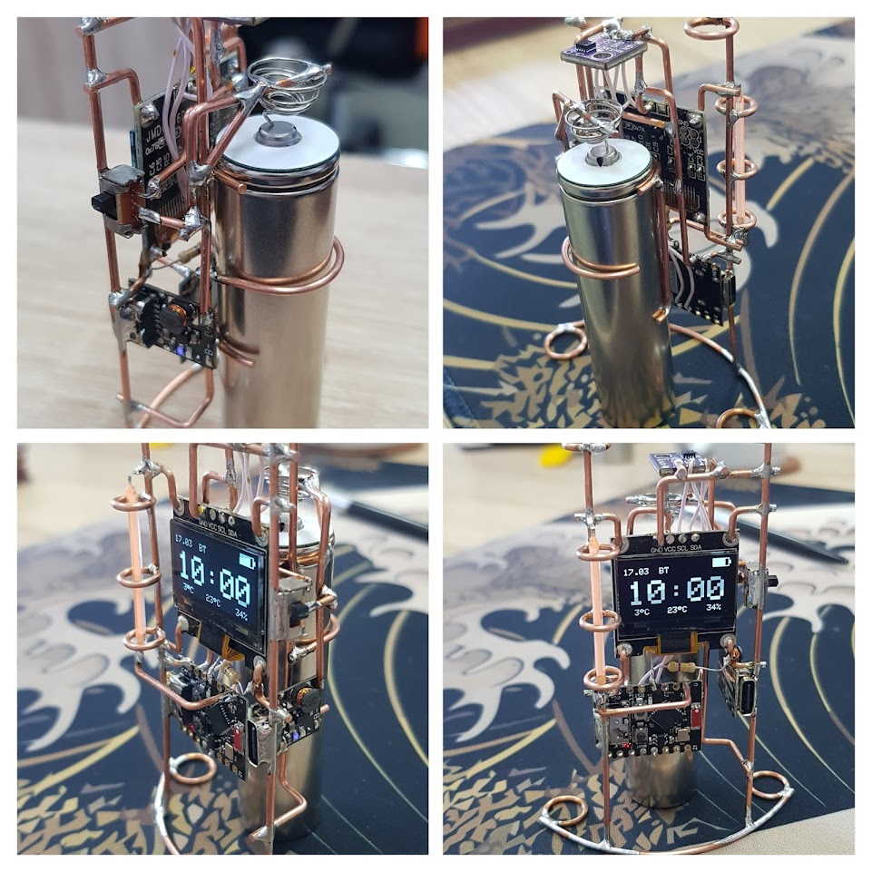

# Celsius Clock (ESP32-C3)

Battery-powered ESP32-C3 clock with OLED, deep sleep, WiFi/NTP sync, outdoor weather, OTA update, and modular indoor sensor selection from web admin.

## Branches

- `128x64` - SSD1306 128x64 (landscape), this README matches this branch.
- `main` / `correction` - SSD1306 128x32 variants.

## Current Core Features

- Deep sleep cycle with minute-aligned wakeups.
- RTC-backed time base (`storedEpoch`) with:
  - NTP sync over multiple fallback servers,
  - automatic drift compensation,
  - manual correction (`seconds/day`).
- User-configurable timezone in web admin (`UTC offset` select).  
  NTP now applies `settings.timezoneMinutes` at sync time.
- Outdoor weather from Open-Meteo:
  - update interval 1..24h,
  - WiFi on-demand only,
  - weather cache in RTC.
- 5-page detailed weather screen by GPIO4 button (cached data only; no extra HTTP on button press).
- Web setup mode (AP + admin page) with full device configuration.
- OTA from setup page with safety prechecks.
- AutoOTA check/update support (configurable, optional).
- JSON export/import of settings from admin page (safe mode: no WiFi credentials in JSON).

## Indoor Sensor Architecture

Sensor logic is modular and stored under `sensors/`:

- `sensors/SensorTypes.h`
- `sensors/SensorManager.h`
- `sensors/sht31/SHT31Sensor.h`
- `sensors/aht20bmp280/AHT20BMP280Sensor.h`
- `sensors/aht21/AHT21Sensor.h`
- `sensors/htu21/HTU21Sensor.h`
- `sensors/bmi160/BMI160Motion.h`

### Supported runtime combinations

- Temperature/Humidity source (single choice, radio in admin UI; no "main" sensor hardcoded):
  - `SHT31`
  - `AHT20 + BMP280`
  - `AHT21`
  - `HTU21`
- Motion wake source:
  - `BMI160` enable/disable (checkbox in admin UI).

## Web Admin (Setup Mode)

Device enters setup mode when WiFi config is missing, invalid, or initial setup is needed.

### AP defaults

- SSID: `CelsiusClock`
- Password: `12345678`
- URL: `http://192.168.4.1`

### Admin sections

- WiFi settings
- Display settings
- Device configuration (sensor gallery + sensor selection)
- Night mode
- Work days
- NTP/time correction + timezone select
- Weather settings
- Auto OTA
- Settings backup (export/import JSON)
- Firmware OTA upload
- Reset settings

## Settings JSON Backup/Restore

### Endpoints

- `GET /settings/export`
- `POST /settings/import`

### Security policy

- WiFi credentials are never exported to JSON.
- WiFi credentials are never imported from JSON.

### Default template

Root file `settings.json` contains baseline defaults for provisioning and mass setup.

## OTA

### Web OTA

- Upload `Celsius.ino.bin` from setup page.
- Prechecks:
  - setup mode only,
  - OTA partition available,
  - battery above threshold (`OTA_MIN_BATTERY_V`).

### AutoOTA

- Manifest URL is branch-aware (`AUTOOTA_BRANCH`).
- Checks are constrained by time/day state and battery threshold.
- Interval is configurable in admin (`autoOtaCheckHours`).

## Pins (ESP32-C3)

- I2C SDA: GPIO8
- I2C SCL: GPIO9
- LED: GPIO0
- Setup button: GPIO1
- Weather/detail button wake: GPIO4 (LOW to GND)
- BMI160 INT1 wake: GPIO5 (optional, HIGH wake)
- Battery ADC: GPIO3
- OLED I2C address: `0x3C`

## Display Behavior (128x64)

- Top row: weekday/date + battery icon.
- Main area: large time.
- Bottom row: outdoor + indoor values.
- Detailed weather by GPIO4: 5 screens from cached RTC weather data:
  1. Current outdoor temperature + feels-like
  2. Wind speed + direction
  3. Humidity + pressure
  4. Current icon + precipitation + nearest night minimum
  5. Forecast for tomorrow + next 2 days

## Build/Dependencies

Required Arduino libraries:

- GyverOLED
- NTPClient
- ArduinoJson
- Adafruit SHT31 (if SHT31 is selected)
- Adafruit AHTX0 (if AHT20/AHT21 is selected)
- Adafruit BMP280 (if AHT20+BMP280 is selected)
- Adafruit HTU21DF (if HTU21 is selected)

Built-in core libs:

- `WiFi.h`, `WiFiUdp.h`, `Wire.h`, `WebServer.h`, `EEPROM.h`, `Update.h`

## Notes

- EEPROM settings are protected by size check (`static_assert`).
- Device stays in low-power profile between active cycles.
- Weather and NTP use explicit WiFi connect/disconnect strategy to reduce power consumption.

## License

Open source for personal and educational use.

